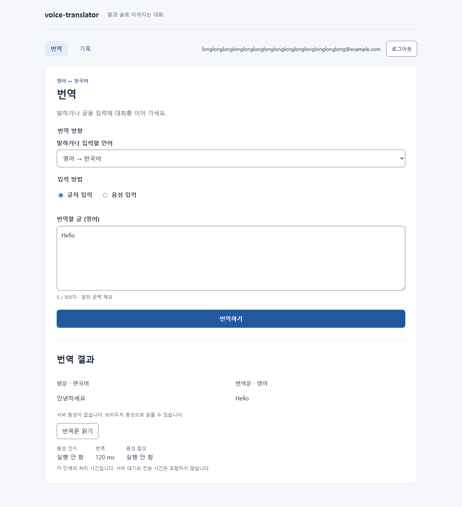
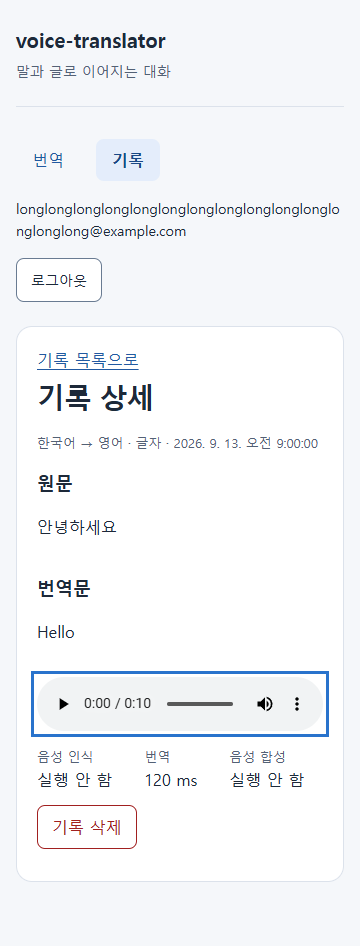

# voice-translator

영어↔한국어 음성 번역 웹 서비스. 말하거나 입력하면 음성 인식(STT), 번역, 음성 합성(TTS)을 거쳐 원문과 번역문을 보여 주고 번역문을 읽어 준다. 로그인한 사용자별로 번역 기록을 남긴다. 모델은 모두 로컬 GPU에서 돌고, 공개 평가 데이터(Google FLEURS)로 측정해서 골랐다.

| 번역 화면 (데스크톱) | 기록 상세 (360px) |
|---|---|
|  |  |

화면은 브라우저 접근성 검사(`npm run test:a11y`)가 찍은 것으로, API 응답은 검사용 가짜 값이다.

## 구성

| 항목 | 내용 |
|---|---|
| 백엔드 | FastAPI(비동기), SQLAlchemy 2.0, PostgreSQL 16, Alembic, JWT 인증 |
| 프론트엔드 | React + TypeScript (Vite), 브라우저 마이크 녹음(MediaRecorder) |
| 음성 인식 | Whisper large-v3-turbo (faster-whisper / CTranslate2, GPU float16) + VAD |
| 번역 | opus-mt-tc-big 한→영·영→한 (CTranslate2로 변환), 영→한은 문장 단위로 번역 |
| 오타 교정 | 글자로 입력한 영어만 번역 전에 qwen2.5 1.5B(Ollama)로 오타·띄어쓰기를 고침 |
| 음성 합성 | 한국어 MeloTTS, 영어 Kokoro-82M |
| 대화 모드 | 버튼 없이 말하고 멈추면 번역 음성까지. 브라우저에서 Silero VAD(onnxruntime-web)가 1초 쉼을 말 끝으로 판정해 한 마디씩 보냄, 재생 중에는 듣지 않음 |
| 배포 | Docker Compose: db, api(GPU), ollama(GPU, 오타 교정), web(nginx가 화면과 `/api` 프록시) |

### 측정해서 고른 결과

선택은 FLEURS validation으로, 확인은 고른 설정만 test로 한 번 했다. 후보, 판단 규칙(측정 전에 기록), 전체 수치는 [docs/experiments.md](docs/experiments.md)에 있다.

| 단계 | 고른 것 | test 결과 |
|---|---|---|
| 음성 인식 | large-v3-turbo + VAD | 한국어 CER 4.57%, 영어 WER 4.95%. 음성 1초당 처리 약 0.04초 |
| 번역 | opus-mt-tc-big | chrF 한→영 55.7, 영→한 36.1 |
| 대화 모드 말 끝 판정 | Silero VAD, 1초 쉼 (음량 기준 판정보다 잡음에 강함) | 문장이 중간에 잘리는 비율 2.2~3.1%, 붙음·놓침 0, 말이 끝나고 판정까지 약 1.17초. 말을 멈춘 뒤 번역 음성까지 약 2.0초(추정). 1.5초 목표와 잘림 5% 이하를 함께 만족하는 방법이 없어 문장을 온전히 번역하는 쪽을 골랐다 |
| 오타 교정 (영어 글자 입력) | qwen2.5 1.5B로 교정한 뒤 번역 | 오타를 섞은 영→한 chrF 27.5 → 34.8, 깨끗한 입력 36.1 → 36.6. 문장당 약 0.15초 추가. 한국어 입력은 교정이 깨끗한 문장을 망가뜨려 쓰지 않음 |
| 음성 합성 | MeloTTS(한), Kokoro(영) | 합성 음성을 다시 인식한 오류: 한국어 CER 5.58%, 영어 WER 3.91% |
| 전체 흐름 | 위 조합, 모델 스레드 1개 | 10초 음성 → 원문·번역문·번역 음성까지 중앙값 0.89초(p95 1.62초), 동시 2요청 1.54초. 번역 중 다른 요청 응답 p95 0.033초 |

GPU는 RTX 2080 Ti(11GB)에서 쟀고, 세 모델이 올라간 서버는 VRAM 약 4.6~5.1GB를 쓴다. 오타 교정 모델(Ollama)이 약 1.3GB를 더 쓴다.

## 전체 실행 (Docker)

준비: NVIDIA GPU, GPU를 쓸 수 있는 Docker(Windows는 Docker Desktop + WSL2), Python 3.11과 [uv](https://docs.astral.sh/uv/) (번역 모델 변환에만 필요).

번역 모델은 이미지에 넣지 않고 `data/models/ct2`에서 읽는다. 처음 한 번 변환한다. Hugging Face에 올라온 tc-big 변환본은 어휘가 깨져 있어서, Helsinki의 원본 배포본(각 약 740MB)을 받아 CTranslate2로 바꾼다.

```bash
cd backend
uv sync --group gpu --group eval
uv run python -m eval.fleurs_download --splits validation   # 변환 뒤 토큰 확인에 쓰는 문장
uv run python -m eval.mt_convert --models opus-mt-tc-big-ko-en opus-mt-tc-big-en-ko
cd ..
docker compose up -d --build
```

http://localhost:8080 에서 쓴다 (포트는 `.env`의 `WEB_HOST_PORT`). 처음 시작할 때 음성 인식·합성 가중치(약 2.5GB)를 `hfcache` 볼륨으로 받고, 모델을 올린 뒤 한 번씩 돌려 둔 다음 준비 완료가 된다. 오타 교정 모델(약 1GB)은 뒤에서 `ollama` 볼륨으로 받아 올리고, 그동안 영어 글자 입력은 교정 없이 번역된다. 로그인이 서버 재시작 뒤에도 유지되게 하려면 `.env`에 `JWT_SECRET_KEY`를 둔다 (`.env.example` 참고).

## 로컬 개발

준비: Python 3.11, uv, Node.js 24, Docker. 명령은 프로젝트 폴더에서 시작하고, 백엔드와 프론트엔드는 각각 다른 터미널에서 실행한다.

```bash
# 1. DB (이 PC에서만 접속: 127.0.0.1:55442. Windows가 예약하는 5432~5631을 피함.
#    다른 PC에서 접속해야 하면 .env의 POSTGRES_HOST_IP를 바꾸고 예시 비밀번호부터 바꾼다)
cp .env.example .env
docker compose up -d db
```

```bash
# 2. 백엔드: http://localhost:8000/api/health
cd backend
uv sync --group gpu --group tts
uv run alembic upgrade head
LOAD_MODELS=true uv run uvicorn app.main:app
```

API는 `.env`를 자동으로 읽지 않는다. 기본값이 위 compose DB와 같아서 그대로 실행하면 되고, 바꿀 값은 환경 변수로 넘긴다 ([docs/api.md](docs/api.md)의 "실행 설정과 DB"). `LOAD_MODELS`를 빼면 모델 없이 떠서 번역 요청은 503을 돌려준다. 이때 화면만 보려면 프론트엔드를 `VITE_TRANSLATION_MOCK=true`로 실행한다.

```bash
# 3. 프론트엔드: http://localhost:5173 (/api 요청은 개발 서버가 백엔드로 넘김)
cd frontend
npm install
npm run dev
```

## 테스트

```bash
(cd backend && uv run ruff check . && uv run pytest)
(cd frontend && npm run lint && npm test && npm run build)
(cd frontend && npm run test:a11y)   # Playwright + Microsoft Edge, 키보드·axe(WCAG 2.2 AA)·360px 검사
```

백엔드 테스트는 compose DB에 테스트 전용 DB(`vt_test_<임의 문자열>`)를 만들어 쓰고 끝나면 지운다. 모델은 가짜 구현으로 대체한다. push와 PR마다 GitHub Actions가 백엔드·프론트엔드 검사를 돌린다 (`.github/workflows/ci.yml`, 브라우저 검사는 로컬에서만).

## 측정 다시 하기

```bash
cd backend
uv sync --group gpu --group eval
uv run python -m eval.fleurs_download        # FLEURS 한국어·영어 validation·test (약 1GB)
```

단계별 명령과 판단 규칙은 [docs/experiments.md](docs/experiments.md)에 있다 (`eval.stt_eval`, `eval.mt_eval`, `eval.tts_eval`, `eval.e2e_eval`). 리포트는 `backend/eval/reports/`에 남긴다. 음성 합성 모델은 transformers 버전이 달라 `tts` 그룹과 `eval` 그룹을 함께 설치할 수 없다. 서버를 다시 돌릴 때는 `uv sync --group gpu --group tts`로 되돌린다.

## 설계 판단

- **측정해서 고르기**: 단계마다 후보와 판단 규칙을 측정 전에 [docs/experiments.md](docs/experiments.md)에 적고 커밋한 뒤 잰다. 규칙이 정하지 않은 경우가 생기면 그 사실과 판단을 따로 적는다
- **모델 호출은 전용 스레드에서**: 인식·번역·합성은 이벤트 루프 밖의 스레드 하나에서 돈다. 그래도 번역 중 다른 요청이 0.3초씩 막혀서 원인을 찾았다: faster-whisper가 음성을 읽을 때마다 부르는 전체 가비지 컬렉션이 모델의 수많은 객체를 훑으며 GIL을 쥐고 있었다. 모델을 올린 직후 `gc.freeze()`로 해결했다 (0.33초 → 0.03초)
- **말이 없는 녹음**: VAD로 말소리 구간만 인식 모델에 넘긴다. 켜기 전에는 무음에서 "Thank you." 같은 문장을 지어냈다
- **영→한은 문장 단위 번역**: opus-mt는 한 문장씩 학습돼 여러 문장 입력에서 문장을 빠뜨렸다. 나눠 번역하니 누락이 줄었다. 한→영은 차이가 없어 통째로 번역한다
- **녹음 원본은 저장하지 않는다**: 인식된 글자와 번역 음성만 기록에 남긴다. 번역 음성은 인증된 요청으로만 받는다
- **음성 합성이 실패해도 번역은 돌려준다**: 응답에 `tts_error`를 싣고, 화면은 브라우저 내장 음성으로 읽는다

## 알려진 한계

- **메모리 기준 미달 (T23)**: 서버 할당 메모리가 첫 요청 240개 동안 230~380MB 늘고 멈춘다. 측정 전에 정한 한도(300MB)를 세 설정 모두 넘었고, 설정과 관계없는 초기화로 보여 지연을 푼 설정(`gc.freeze`)을 그대로 쓴다
- **평가 데이터**: FLEURS는 위키 문체의 긴 문장이라 짧은 대화체와 다르다. 참조 번역이 하나라 맞는 다른 표현도 감점된다. 영→한 chrF가 한→영보다 20점 낮은 것은 모든 후보에 공통이다
- **측정 환경**: 한 PC(RTX 2080 Ti, Windows)에서 서버와 측정 도구를 함께 돌렸다. 다른 GPU나 여러 대에서는 재지 않았다
- **접근성**: 키보드·axe·360px 검사는 자동이다. 스크린리더와 실제 마이크로는 사람이 확인해야 한다
- **대화 모드**: 말 끝 판정은 FLEURS를 이어 붙인 녹음과 합성 잡음으로 쟀다. 읽는 말투라 실제 대화의 머뭇거림과 다르고, 실제 마이크·스피커로 쓴 확인은 아직 없다. 브라우저 판정이 오프라인 측정과 같은 결과를 내는 것은 같은 음성으로 확인했다. 대화 모드를 처음 켜면 말소리 판정 파일(WASM 약 14MB, gzip 약 3.7MB)을 한 번 받는다
- **가끔 느려지는 서버 인식 (T42)**: 측정 중 약 10분 동안 인식이 5~43초 걸린 구간이 두 번 있었다. 같은 음성을 다시 보내면 정상이었고 원인은 찾지 못했다
- **음성 합성 준비물**: MeloTTS는 쓰지 않는 언어의 BERT 토크나이저도 받는다(프랑스어·스페인어·일본어·다국어). Windows에서는 MeloTTS와 Kokoro에 작은 우회가 필요하고 코드에 들어 있다 (Linux 컨테이너는 필요 없음)

## 모델과 데이터의 라이선스

| 쓰임 | 이름 | 만든 곳 | 라이선스 | 원본 |
|---|---|---|---|---|
| 음성 인식 | Whisper large-v3-turbo | OpenAI | MIT | [openai/whisper-large-v3-turbo](https://huggingface.co/openai/whisper-large-v3-turbo) |
| 음성 인식 (쓰는 변환본) | faster-whisper-large-v3-turbo | Mobius Labs | MIT | [mobiuslabsgmbh/faster-whisper-large-v3-turbo](https://huggingface.co/mobiuslabsgmbh/faster-whisper-large-v3-turbo) |
| 말소리 구간 검출 (서버 인식, 대화 모드의 말 끝 판정) | Silero VAD v6 (faster-whisper에 포함된 ONNX 파일) | Silero | MIT | [snakers4/silero-vad](https://github.com/snakers4/silero-vad). 대화 모드는 같은 파일을 `frontend/src/conversation/assets/`에 넣어 브라우저로 보낸다 (라이선스 원문 동봉) |
| 대화 모드의 브라우저 추론 | onnxruntime-web 1.29.0 | Microsoft | MIT | [microsoft/onnxruntime](https://github.com/microsoft/onnxruntime). WASM 파일을 화면과 함께 배포 (라이선스 원문 동봉) |
| 오타 교정 (영어 글자 입력) | Qwen2.5-1.5B-Instruct (Ollama `qwen2.5:1.5b-instruct`) | Alibaba Cloud Qwen | Apache-2.0 | [Qwen/Qwen2.5-1.5B-Instruct](https://huggingface.co/Qwen/Qwen2.5-1.5B-Instruct) |
| 번역 한→영 | opus-mt-tc-big-ko-en | Helsinki-NLP (University of Helsinki) | CC-BY-4.0 | [Helsinki-NLP/opus-mt-tc-big-ko-en](https://huggingface.co/Helsinki-NLP/opus-mt-tc-big-ko-en). 원본 MarianNMT 배포본을 CTranslate2로 변환해 씀 |
| 번역 영→한 | opus-mt-tc-big-en-ko | Helsinki-NLP (University of Helsinki) | CC-BY-4.0 | [Helsinki-NLP/opus-mt-tc-big-en-ko](https://huggingface.co/Helsinki-NLP/opus-mt-tc-big-en-ko). 위와 같이 변환 |
| 음성 합성 한국어 | MeloTTS-Korean | MyShell.ai | MIT | [myshell-ai/MeloTTS](https://github.com/myshell-ai/MeloTTS), [myshell-ai/MeloTTS-Korean](https://huggingface.co/myshell-ai/MeloTTS-Korean) |
| MeloTTS 한국어 전처리 | bert-kor-base | Kiyoung Kim | 모델 카드에 표기 없음 (원 저장소 [kiyoungkim1/LMkor](https://github.com/kiyoungkim1/LMkor)는 Apache-2.0) | [kykim/bert-kor-base](https://huggingface.co/kykim/bert-kor-base) |
| MeloTTS 영어 전처리 | bert-base-uncased | Google | Apache-2.0 | [google-bert/bert-base-uncased](https://huggingface.co/google-bert/bert-base-uncased) |
| MeloTTS가 함께 받는 토크나이저 | bert-base-multilingual-uncased | Google | Apache-2.0 | [google-bert/bert-base-multilingual-uncased](https://huggingface.co/google-bert/bert-base-multilingual-uncased) |
| 〃 | bert-base-french-europeana-cased | dbmdz | MIT | [dbmdz/bert-base-french-europeana-cased](https://huggingface.co/dbmdz/bert-base-french-europeana-cased) |
| 〃 | bert-base-spanish-wwm-uncased (BETO) | dccuchile | 모델 카드에 표기 없음 (원 저장소 [dccuchile/beto](https://github.com/dccuchile/beto)는 CC-BY-4.0) | [dccuchile/bert-base-spanish-wwm-uncased](https://huggingface.co/dccuchile/bert-base-spanish-wwm-uncased) |
| 〃 | bert-base-japanese-v3 | Tohoku NLP | Apache-2.0 | [tohoku-nlp/bert-base-japanese-v3](https://huggingface.co/tohoku-nlp/bert-base-japanese-v3) |
| 음성 합성 영어 | Kokoro-82M | hexgrad | Apache-2.0 | [hexgrad/Kokoro-82M](https://huggingface.co/hexgrad/Kokoro-82M) |
| 평가 데이터 | FLEURS | Google | CC-BY-4.0 | [google/fleurs](https://huggingface.co/datasets/google/fleurs) |

라이선스는 2026-09-13~14에 각 모델 카드와 저장소에서 확인했다. 저장소에 들어 있는 모델 가중치는 대화 모드용 Silero VAD v6 ONNX 파일(1.2MB) 하나이고, 나머지는 실행할 때 원본에서 받는다.

## 문서

- [docs/api.md](docs/api.md): API 요청·응답, 오류, 실행 설정
- [docs/experiments.md](docs/experiments.md): 모델 측정 절차·규칙·결과
- [docs/plan.md](docs/plan.md): 개발 시작 전 계획
